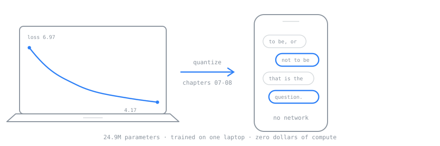
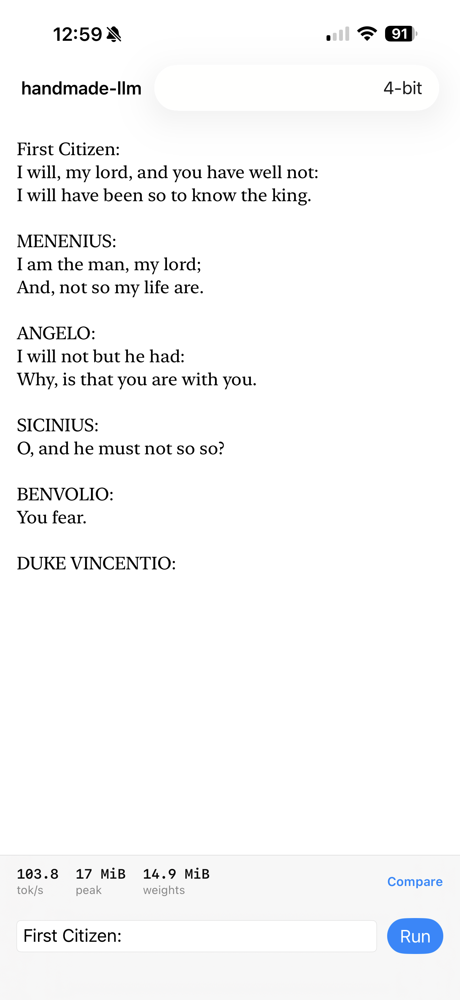
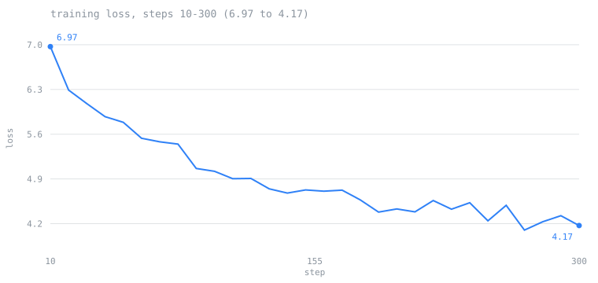

# handmade-llm



**Train a real language model from scratch on the Mac you already own — then put it on your iPhone.**

No CUDA. No cloud bill. No rented A100s. A laptop, eight chapters, and a model that ends up talking to you from your own pocket.


*A tokenizer built from your own text, then the loss starting to fall. Both on an M1 Pro, both in under a minute, nothing rented. The recording is a script — [`docs/assets/demo.tape`](docs/assets/demo.tape) — so it can be regenerated when the output changes rather than going quietly stale.*

And then the part that made me write this instead of reading someone else's:

<p align="center">
  
</p>

*The same model, on an iPhone, offline. 14.9 MiB of weights, 17 MiB of peak memory, no network code and no permissions requested. It is 300 training steps and it does not write English — it writes the shape of a play, which is the honest result and the one the chapter argues you should expect.*

---

## Why this exists

I kept running into the same wall. Every good "build an LLM from scratch" repository assumes a machine I did not have. `nvidia-smi`, a rented GPU, an eight-card node. The code was excellent and none of it ran on my desk.

So I wrote it on what was on my desk: an M1 Pro with 16 GB of unified memory. The smallest Apple Silicon machine you can reasonably buy. If it runs there, it runs everywhere above it.

That constraint turned out to be the interesting part. When you cannot brute-force anything, you have to actually understand where the memory goes, why the batch size matters, what a KV-cache really costs you. The limit teaches you. I did not plan that — it just happened that way, and I would not change it now.

## What you build

Eight chapters. Each one runs on its own, each one is a few hundred readable lines, each one ends with something you can see working.

| | Chapter | What comes out of it |
|---|---|---|
| 00 | `00_setup` | Your machine, measured. Memory budget and a tokens/sec baseline. |
| 01 | `01_tokenizer` | Byte-level BPE, from scratch. Trained on your own text. |
| 02 | `02_model` | A transformer in MLX. One file. No framework underneath it. |
| 03 | `03_train` | The training loop. Loss curve, checkpoints, resume, 16 GB survival. |
| 04 | `04_scale` | Which chip holds which config. Measured, not guessed. |
| 05 | `05_finetune` | SFT and LoRA. Your model starts answering instead of rambling. |
| 06 | `06_eval` | Did it actually learn something, or does it just sound like it did? |
| 07 | `07_quantize` | 4-bit. What you gain, what you give up, in numbers. |
| 08 | `08_ship_ios` | mlx-swift and SwiftUI. The model runs on your phone, offline. |

That last chapter is the one I have not seen anywhere else. Plenty of repositories teach you to train a model. Almost none of them hand it back to you as an app you can open on the train.

Each chapter has a short page in [`docs/`](docs/) — what it does, why it is built that way, and the numbers it produced on my machine. And [`docs/LESSONS.md`](docs/LESSONS.md) is the other half of that: the things I got wrong first, including the benchmark number that was fifty times off and nearly shipped. The fixes are in the code; the reasons are only there.

[`docs/AUDIT.md`](docs/AUDIT.md) is the last pass over all of it before this went public — every suite re-run rather than recalled, and the three defects that pass found, including the one where recording the demo for this README destroyed the checkpoint the whole repository is measured against.

## Two claims, and the receipts

Most repositories tell you their fast path is equivalent to the obvious one, and that their checkpoints resume cleanly. I wrote the tests instead.

**Every shortcut is proved equivalent to the version you can read.** Chapter 01 keeps the textbook BPE trainer next to the fast one and asserts they learn byte-identical merges — the fast one turned ten minutes into 6.2 seconds. Chapter 02 keeps an explicit softmax next to MLX's fused kernel and asserts they agree. The readable version explains, the fast version ships, and the test is what makes that an argument rather than a promise.

**Training here is not bit-reproducible, and I can show you.** Same seed, same config, two runs: identical at step 10, identical at step 30, apart by 0.0016 at step 60. That is what a GPU reduction does to floating-point addition, it is not a bug, and it decides what a checkpoint can honestly claim. [`docs/REPRODUCIBILITY.md`](docs/REPRODUCIBILITY.md) has the experiments, the numbers, and the parts that *are* deterministic — the data pipeline, the schedule, the forward pass.

I have not found another training repository that checks this. Everyone sets the seed and moves on.

## Quickstart

```bash
git clone https://github.com/selimfedakar/handmade-llm
cd handmade-llm
pip install -r requirements.txt

python 00_setup/check_mac.py          # what your machine can handle
python data/download.py               # a small corpus to start on
python 01_tokenizer/train_tokenizer.py --vocab-size 4096
python 02_model/demo.py               # an untrained model, generating
python 03_train/train.py --steps 300  # the loss starts falling
```

On an M1 Pro with 16 GB that is about four minutes from clone to a falling loss curve. Here is mine, drawn straight from `runs/latest/log.jsonl` by `03_train/plot_loss.py` — no plotting library, the SVG is written by hand:



Three hundred steps is four passes over TinyShakespeare and far too few to expect English. It is enough to see the loop working. All eight chapters work today.

Once it has trained, shrink it:

```bash
python 07_quantize/compare.py          # float32 against 4-bit, on your machine
```

On an M1 Pro that model goes from 95.04 MiB to 14.88 MiB — 6.4x — while bits per byte moves from 2.134 to 2.136. Training moved the model 1.964 bits per byte away from knowing nothing; quantizing gives back 0.002 of it, and chapter 06's context probe is still positive on six seeds out of six afterwards.

The quantizer is written out rather than imported, and the test asserts it produces *byte-identical* output to MLX's own kernel across all 24.9M weights of the trained checkpoint. [`docs/07-quantize.md`](docs/07-quantize.md) also has the speed measurement I got wrong the first time — measuring two models one after the other on a laptop that drifts is not measuring them under the same conditions, and it made a real 6% difference look like no difference at all.

Then put it on your phone:

```bash
python 08_ship_ios/export_golden.py    # what the Swift side has to agree with
python 08_ship_ios/bundle_model.py     # 14.9 MiB into the app bundle
open 08_ship_ios/HandmadeLLMApp/HandmadeLLMApp.xcodeproj
```

A SwiftPM package holds the tokenizer and the transformer, rewritten in Swift on top of [mlx-swift](https://github.com/ml-explore/mlx-swift); the Xcode project is one SwiftUI screen on top of that. No network code, no permissions, nothing downloaded at run time.

And the same claim gets the same treatment as everywhere else in this repository — **the Swift side is asserted to agree with the Python side, and you can run the assertion**:

```bash
cd 08_ship_ios/HandmadeLLM
xcodebuild test -scheme HandmadeLLM -destination 'platform=OS X,arch=arm64' \
  -skipPackagePluginValidation -skipMacroValidation
```

Thirty-two tests, on a fresh clone, with no corpus and no training run and no phone: a 106,496-weight model ships in the repository in both float32 and 4-bit form, with the logits Python got out of it. Both come back **bit-identical** in Swift, and the 24.9M checkpoint agrees to 1.4e-06 — which is less than the gap between MLX's fused attention and the written-out softmax *inside Python alone*, and [`docs/08-ship_ios.md`](docs/08-ship_ios.md) shows the measurement that establishes that.

The awkward half of that chapter is the tokenizer. Chapter 01 splits text with a Python regular expression, and `\w` means a different set of characters to Python's `re` than it does to the ICU engine behind `NSRegularExpression` — they agree on every character in TinyShakespeare and disagree on combining marks and connector punctuation. So the splitter is written out by hand in Swift, predicate by predicate, and checked against 49 texts chosen to break it. One of the things that falls out: chapter 01's tokenizer cannot see an underscore at all. `"snake_case_name"` is three tokens and the underscores are gone.

And the phone finally answers a question chapter 07 refused to answer on the laptop. On an iPhone 17 Pro Max, both models resident and timed in one alternating loop, both orders: **4-bit is ahead in fourteen paired rounds out of fourteen**, at 1.066x and 1.088x — the same band the laptop produced. Peak memory travels too, 98 MiB against 17 where the Mac measured 97 against 18. What does not travel is absolute speed, which is about 40% of the laptop's.

The screen's own tokens-per-second readout, if you read it as a comparison, says the opposite. That is the whole reason there is a separate Compare button, and [`docs/08-ship_ios.md`](docs/08-ship_ios.md) works through why.

Before you pick a size, ask what your machine will hold:

```bash
python 04_scale/sweep.py               # predicted vs measured, on your chip
```

On a 16 GB M1 Pro: 78.7M parameters train at batch 8 × 512, and stop there.

Training on a laptop you also need for other things:

```bash
python 03_train/train.py --steps 5000 --stop-after 500      # an hour tonight
python 03_train/train.py --steps 5000 --resume runs/latest/checkpoint   # tomorrow
```

`--steps` describes the whole run, so the schedule does not care how many sittings you take.

## Why MLX and not PyTorch

PyTorch on MPS works, mostly. But "mostly" is where the evenings go: an operator that silently falls back to CPU, a dtype that behaves differently than it does on CUDA, a memory model built for a machine with a separate GPU card.

MLX was built for this hardware. Unified memory is the default assumption, not a workaround. On an M1 Pro the difference is not subtle.

And there is a second reason, which only shows up in chapter 08: `mlx-swift` exists. That is the bridge that lets a model you trained in Python on Monday run inside a Swift app on Tuesday. Without it, the last chapter cannot be written at all.

Where the PyTorch equivalent is meaningfully different, each chapter says so.

## This is not a nanoGPT replacement

Andrej Karpathy's [nanoGPT](https://github.com/karpathy/nanoGPT) and Sebastian Raschka's [LLMs-from-scratch](https://github.com/rasbt/LLMs-from-scratch) are the reason a repository like this one can exist at all. I learned from both. If you have a CUDA machine and you want to reproduce GPT-2 properly, go there.

This repository answers a narrower question: *what is the complete chain, from raw bytes to an app on your phone, on a laptop with no discrete GPU?*

Different promise. Same family.

## The benchmark table

[`bench/`](bench/) holds a community table: the same 24.9M model on every chip. No corpus, no tokenizer, nothing to download — one command, about a minute, one row.

```bash
python bench/run.py --submit
```

| Chip | GiB | Train tok/s | Generate tok/s | Peak MiB |
|---|---:|---:|---:|---:|
| Apple M1 Pro | 16 | 11,255 | 377.3 | 2,366 |

I have one Mac. The table is only useful if it has more than one Mac in it — so if you run this, send the numbers back. That table is the thing I would have wanted before buying anything.

## Who is writing this

I am Ahmet Selim Fedakar, a computer science undergraduate in Los Angeles. I co-founded EXCAR and Auris, two AI voice startups, where I build the machine learning and speech systems; separately, I have shipped two apps to the App Store on my own.

The work here comes out of a year of language modelling done end to end rather than in pieces — tokenizer, architecture, pretraining, fine-tuning, evaluation, quantization — including Stanford's CS336, which I worked through alone. This repository is where the parts that finally made sense get written down properly, and where the numbers behind them are measured rather than assumed.

What I wanted was for the whole chain to fit on one laptop. I kept going until it did.

## License

MIT. Take it, teach with it, ship with it.
